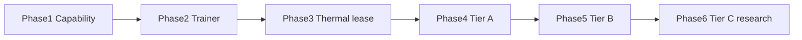

# Lộ trình huấn luyện phân tán

> Tài liệu chủ: [`00-TONG-QUAN-KY-THUAT.md`](00-TONG-QUAN-KY-THUAT.md)
> Kiến trúc: [`THERMAL_TRAINING_ARCHITECTURE.md`](THERMAL_TRAINING_ARCHITECTURE.md)
> Scheduler: [`THERMAL_SCHEDULER_V2.md`](THERMAL_SCHEDULER_V2.md)
> **Trạng thái:** kế hoạch kỹ thuật. Không gắn lịch T1–T12 thương mại.

Lộ trình inference M0–M6 nằm ở [`12-lo-trinh-va-milestone.md`](12-lo-trinh-va-milestone.md)
và **không bị thay**. File này là **phase mới**, bắt đầu sau (hoặc song song
cẩn thận với) sản phẩm chat đang chạy.

Nguyên tắc xếp việc:

1. **Đo máy trước khi train** — Phase 1 trước Phase 2.
2. **Một process train trên một máy trước khi nhiều expert** — 2 trước 4.
3. **Lease/user/nhiệt trước khi gọi là distributed** — 3 trước 4.
4. **Tầng A trước B trước C.**
5. **Mỗi phase có acceptance chạy được**, không chỉ tài liệu.
6. **Không ship Tầng C.**

Ước lượng công: một người quen repo, ngày làm việc đầy đủ. Nhân 1.5–2 nếu
vừa giữ inference vừa làm training.

---

## Tổng quan phụ thuộc



ADR phải viết **trước** code phase tương ứng: ADR-008 (capability
fail-closed) với Phase 1; ADR-009 (Python trainer add-on, không phá ADR-005)
với Phase 2. Không sửa nội dung ADR-001…007 đã chốt.

---

## Phase 1 — Capability Foundation

**Mục tiêu:** Host biết máy là gì. UNKNOWN ≠ SUPPORTED.

### Phụ thuộc

Inference join/ingest đang chạy. Không phụ thuộc PyTorch.

### Việc

| # | Việc | Output |
|---|---|---|
| 1 | ADR-008: fail-closed, schema manifest | ADR trong `docs/adr/` |
| 2 | `CapabilityProbe` (C#): OS, arch, cores, RAM, RAM trống, disk, GPU vendor/model/VRAM, CUDA/ROCm, CC, FP16/BF16 | Field MEASURED/UNKNOWN |
| 3 | Sửa join stub `ram_gb=0` / `has_gpu=false` | Manifest thật hoặc UNKNOWN tường minh |
| 4 | Persist capability trên Host | Bảng/store; ForecastCache có `ram_gb`, `vram_mb`, `node_class` |
| 5 | Sửa `meets_capability` fail-open | Test: thiếu VRAM → loại |
| 6 | Gán node class C0…G5 | Dashboard hiện class |
| 7 | `NetworkProbe` chậm: RTT, jitter, throughput thô | Net class N0…N2 |
| 8 | Job `benchmark_device` tùy chọn | `est_samples_per_s` MEASURED |

### Rủi ro

- NVML/CUDA không có trên máy không GPU → phải UNKNOWN, không crash agent.
- LHM GPU temp ≠ VRAM size. Đừng suy VRAM từ nhiệt.
- IT hỏi vì sao agent đọc DXGI/NVML — ghi `IT-WHITELIST` bổ sung.

### Acceptance

- [ ] Ba máy khác cấu hình join; Host hiện class khác nhau.
- [ ] Job giả `min_vram_mb=8000` không vào máy UNKNOWN/C0.
- [ ] Test pytest: `meets_capability` False khi `vram_status=UNKNOWN`.
- [ ] Inference chat **vẫn xanh** (toàn bộ `server/tests`).
- [ ] Agent không gửi `has_gpu=false` cứng nếu probe chưa chạy xong — gửi
      UNKNOWN hoặc MEASURED.

**Không** có training trong phase này.

---

## Phase 2 — Training Runtime

**Mục tiêu:** Agent giám sát một job PyTorch nhỏ, checkpoint, resume sau crash.

### Phụ thuộc

Phase 1 (chọn backend cpu/cuda theo manifest). ADR-009.

### Việc

| # | Việc | Output |
|---|---|---|
| 1 | ADR-009: trainer add-on, pin SHA256, Job Object | SKU tách với inference |
| 2 | Gói `trainer/` (venv/zip) + recipe MNIST hoặc CIFAR-10 / CNN cực nhỏ | Chạy CPU được |
| 3 | `TrainerSupervisor` + JSON-lines protocol | start/pause/checkpoint/resume/stop |
| 4 | Job types `train_expert` (một máy), `evaluate_checkpoint` | `balancer` EXTEND |
| 5 | Artifact store tối thiểu trên Host | Upload/download hash |
| 6 | Checkpoint atomic + sidecar | Resume sau kill trainer |
| 7 | NaN/Inf → `NUMERIC_UNSTABLE` | Không retry vô hạn |
| 8 | Persist job training qua restart Host | SQLite; chat có thể vẫn RAM |
| 9 | Dashboard: job train status (không cần đẹp) | Đọc `events` |

### Rủi ro

- AV chặn `python.exe` / torch DLL (D15). Mitigate: add-on, tài liệu
  whitelist, không nhét vào bootstrapper mặc định.
- Disk dataset: chỉ shard nhỏ PUBLIC.
- Lẫn `train_model.py` (RF ΔT) với DNN trainer — **tên module khác**.

### Acceptance

- [ ] Một worker CPU: recipe CIFAR/MNIST chạy xong, ckpt hash trên Host.
- [ ] Kill trainer giữa chừng → resume đạt loss tiếp, không train từ 0.
- [ ] Máy không cài add-on: `trainer_not_ready`, chat vẫn chạy.
- [ ] Test: hash mismatch shard → không start.
- [ ] Pytest inference không đỏ.

---

## Phase 3 — Thermal-aware Training

**Mục tiêu:** Novelty: lease, preempt nhiệt/user, pause/resume, A/B vs
round-robin.

### Phụ thuộc

Phase 2. ForecastCache + hysteresis v1. UserActivity.

### Việc

| # | Việc | Output |
|---|---|---|
| 1 | Occupancy overlay + ingest `user_active` | USER_ACTIVE |
| 2 | Training lease 120–300s + `POST lease/renew` | granted/deny |
| 3 | Policy `preempt_on_atrisk_or_user` | pause + ckpt |
| 4 | Occupancy `COOLING` | không gán ngay |
| 5 | Scheduler lọc user/capability/cooling | log `[SCHED]` |
| 6 | Harness A/B training (không dùng chung hết với chat) | CSV metrics |
| 7 | Năng lượng: Joule/sample nếu sensor | nhãn source |

### Thí nghiệm bắt buộc (MVP chứng minh)

**Dàn:** 2–3 máy **khác cấu hình** (ví dụ: host laptop + PC + máy không GPU).

**Kịch bản:**

```
Host phát hiện capability
 → chọn worker
 → gửi job PyTorch
 → worker train
 → checkpoint
 → nhiệt tăng hoặc user active (giả lập last-input)
 → scheduler không renew
 → pause
 → cooling hoặc worker khác
 → resume
 → training hoàn thành
```

**Đối chứng:** cùng recipe, `thermal_aware` vs `round_robin`.

**Đo:**

| Metric | Ghi chú |
|---|---|
| Wall time đến mốc chất lượng | Cùng seed/data |
| Throughput samples/s | Trung bình / p50 |
| Max / avg temperature | CPU; GPU nếu MEASURED |
| Thermal throttling | `min_clock_mhz` nếu có |
| Số preemption | deny renew |
| Checkpoint overhead | thời gian pause+ghi+resume |
| User responsiveness | thời gian từ input giả đến CPU/GPU trả (cần định nghĩa script) |
| Energy | kWh/run; Tầng 1 chỉ sensor |
| Final quality | accuracy hoặc val loss |

Không cần model lớn. Không kết luận “xanh hơn GPU server”.

### Rủi ro

- 2 máy không đủ để thấy thermal-aware thắng RR — báo **trung thực** nếu
  hòa/thua ([`CLAIMS_RISKS_LIMITATIONS.md`](CLAIMS_RISKS_LIMITATIONS.md)).
- User activity giả lập ≠ user thật.
- ΔT 3 phút có thể chậm so với lease 180s — có thể phải dùng current temp
  + AT_RISK; ghi lại trong báo cáo thí nghiệm.

### Acceptance

- [ ] Kịch bản trên chạy được end-to-end ít nhất một lần.
- [ ] Deny renew vì `user_active` và vì `at_risk` đều có log.
- [ ] Bảng A/B (dù thermal không thắng) được lưu, không xóa vì “không đẹp”.
- [ ] Chat song song trên node khác không gãy.

---

## Phase 4 — Tầng A (MVP distributed)

**Mục tiêu:** Nhiều expert độc lập, shard, hoàn thành bất đồng bộ,
router/ensemble, recovery.

### Phụ thuộc

Phase 3 (preempt phải chạy, vì nhiều job dài). Dataset Registry tối thiểu.

### Việc

| # | Việc | Output |
|---|---|---|
| 1 | Dataset registry: shard + hash + classification | Worker chỉ tải shard job |
| 2 | Run: N expert, N shard (N=2–3 trên lab) | Job `train_expert` song song |
| 3 | Không chờ expert chậm để train expert nhanh | Completion async |
| 4 | `train_router` hoặc ensemble đơn giản (weighted / argmax) | Eval so với một expert |
| 5 | Failure: chết 1 worker → expert đó resume, expert khác không rollback | |
| 6 | Trust: RESTRICTED không sang worker thiếu level | Test |

### Rủi ro

- Chất lượng ensemble **không** tự bằng model train tập trung — không copy
  số FID Paris.
- Semantic cluster thật (như DDM) là nghiên cứu; MVP được **chia shard
  ngẫu nhiên hoặc theo nhãn** và nói rõ.
- Router train cần dữ liệu validation — đừng dùng test set để claim.

### Acceptance

- [ ] Hai expert xong độc lập trên hai máy khác class.
- [ ] Một expert preempt/resume, expert kia không dừng.
- [ ] Eval router/ensemble chạy; số liệu ghi “thí nghiệm nhỏ”, không “SOTA”.
- [ ] Shard hash sai → expert không start.

---

## Phase 5 — Tầng B (low-communication shared)

**Mục tiêu:** Prototype Local SGD / DiLoCo-like: inner steps local, aggregate
thưa.

### Phụ thuộc

Phase 4 (artifact + lease). Net class N1+. Paper: [`RESEARCH_FOUNDATIONS.md`](RESEARCH_FOUNDATIONS.md).

### Việc

| # | Việc | Output |
|---|---|---|
| 1 | Job `train_local_sgd_round` + `aggregate_update` | Một vòng chạy được |
| 2 | Pseudo-gradient hoặc average weights | Host hoặc một worker G-class |
| 3 | Heterogeneous: straggler không AllReduce từng step | Timeout round → drop hoặc chờ |
| 4 | Đo bytes sync / round | So với baseline “không sync” Tầng A |

### Rủi ro

- WAN/tunnel: sync full ckpt **đắt** — lab LAN.
- Hội tụ DiLoCo trên CNN nhỏ ≠ LLM 400M trong paper.
- Dễ trượt sang “distributed training framework” — giới hạn 1–2 vòng demo.

### Acceptance

- [ ] Hai worker cùng base model, một vòng inner-H steps, một lần aggregate,
      eval chạy.
- [ ] Log số byte đã chuyển.
- [ ] Không AllReduce mỗi step (kiểm bằng instrument, không chỉ comment).
- [ ] Nếu net class N0: job B bị loại `network_mode`.

**Không** bắt buộc thắng Tầng A về accuracy.

---

## Phase 6 — Tầng C (nghiên cứu, không ship)

**Mục tiêu:** Hiểu khi nào pipeline/model parallel **không** làm được trên
đúng topology Thermal_Server; ghi điều kiện mở khóa.

### Phụ thuộc

Phase 5. Đọc SWARM / Petals / HetPipe / PipeDream / Alpa / Zorse.

### Việc

| # | Việc | Output |
|---|---|---|
| 1 | Đo bandwidth/latency thực 2–3 máy | Bảng net |
| 2 | Ước activation size × RTT cho 1 microbatch | Có/không khả thi |
| 3 | Ghi “go/no-go” | Mục trong CLAIMS hoặc ADR-010 nháp |
| 4 | **Không** merge runtime pipeline vào agent | |

### Rủi ro

- Áp lực hồ sơ “phải có Tầng C”. Dùng file này + PDF guide để từ chối.
- Outbound-only: pipeline cần kênh bền — WebSocket worker→host hoặc P2P
  (P2P phá mô hình IT) — quyết định **không** lặng lẽ phá ADR-001.

### Acceptance

- [ ] Tài liệu: điều kiện mạng tối thiểu, ước bubble time, danh sách blocker.
- [ ] Zero dòng runtime C trong `agent/` / `trainer/` trừ prototype **tách**
      repo/nhánh research.

---

## Thứ tự implement chi tiết (sau docs)

1. ADR-008 + CapabilityProbe + sửa `meets_capability` + tests.
2. Persist capability, node class, dashboard tối thiểu.
3. NetworkProbe.
4. ADR-009 + trainer zip pin + Supervisor + job `train_expert` CPU.
5. Artifact + checkpoint resume.
6. UserActivity + occupancy + lease API.
7. Preempt nhiệt/user + cooling.
8. Harness A/B 2–3 máy.
9. Dataset registry + multi-expert.
10. Router/ensemble.
11. (Sau) Local SGD round.
12. (Sau) Nghiên cứu C.

**Không** làm song song 4+5+C.

---

## Liên hệ hồ sơ / PoV thương mại

| Việc bán / cuộc thi | Cần phase kỹ thuật |
|---|---|
| Demo chat thermal-aware | Đã có (inference) |
| Sửa PDF định vị | [`PDF_REVISION_GUIDE.md`](PDF_REVISION_GUIDE.md) — không cần code |
| Demo “máy biết GPU/RAM” | Phase 1 |
| Demo train nhỏ + pause khi đụng chuột | Phase 3 |
| “Distributed” trên slide | Phase 4 — nói expert độc lập, không nói siêu máy tính |
| So với DiLoCo | Phase 5, thí nghiệm nhỏ |
| Petals-like | Phase 6 no-go trừ khi mạng đạt |

Soak 4 giờ, Named Tunnel, Authenticode vẫn thuộc docs/12 — **không** bị
training phase thay thế. Training add-on làm IT whitelist **khó hơn**.
