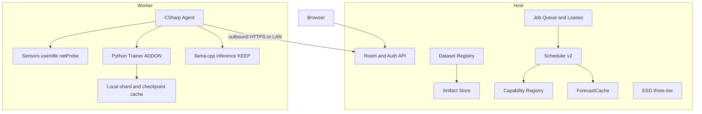
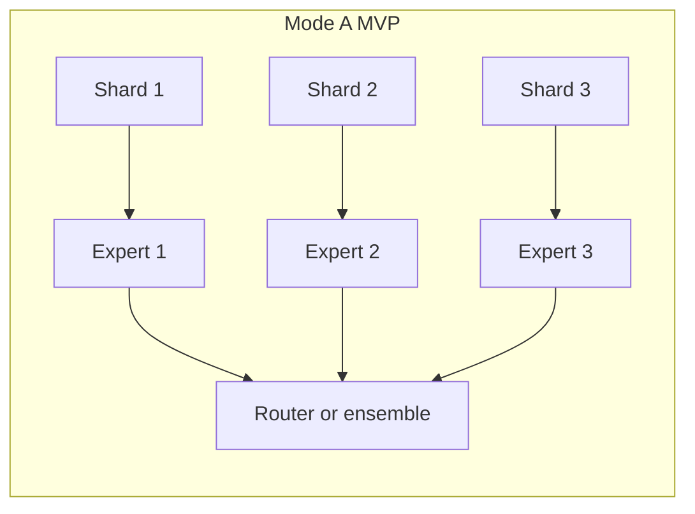
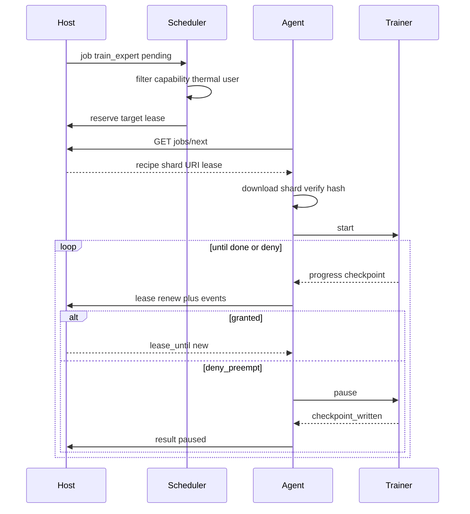
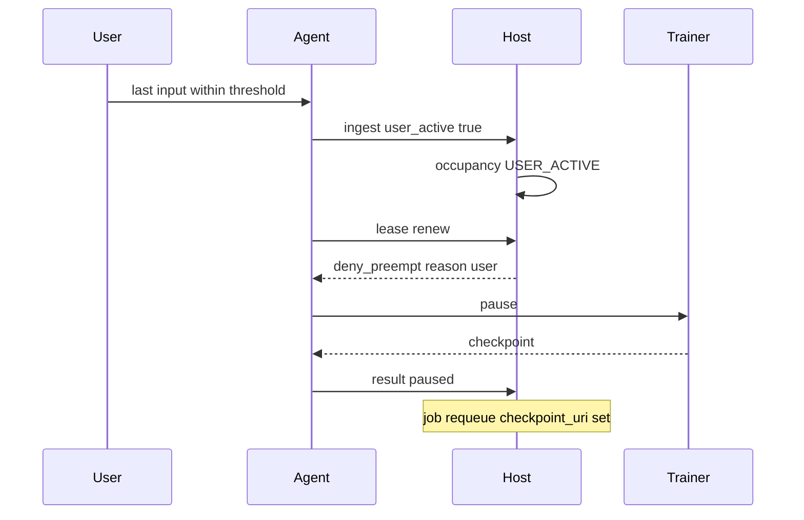

# Kiến trúc huấn luyện nhận thức nhiệt

> Tài liệu chủ: [`00-TONG-QUAN-KY-THUAT.md`](00-TONG-QUAN-KY-THUAT.md)
> Scheduler: [`THERMAL_SCHEDULER_V2.md`](THERMAL_SCHEDULER_V2.md)
> Lộ trình: [`DISTRIBUTED_TRAINING_ROADMAP.md`](DISTRIBUTED_TRAINING_ROADMAP.md)
> **Trạng thái:** thiết kế — **chưa hiện thực**. Inference hiện tại không bị thay
> bởi tài liệu này.

Training là **extension** của kiến trúc Host–Worker đã chạy. Không viết lại
sản phẩm thành framework distributed-training. Không implement Tầng C trong
MVP.

---

## Mục lục

- [1. Nguyên tắc](#1-nguyên-tắc)
- [2. Executive summary kỹ thuật](#2-executive-summary-kỹ-thuật)
- [3. Kiến trúc tổng thể](#3-kiến-trúc-tổng-thể)
- [4. Host](#4-host)
- [5. Worker — NodeAgent](#5-worker--nodeagent)
- [6. Trainer Runtime](#6-trainer-runtime)
- [7. Protocol Agent ↔ Trainer](#7-protocol-agent--trainer)
- [8. Scheduler](#8-scheduler)
- [9. Artifact Store](#9-artifact-store)
- [10. Dataset Registry](#10-dataset-registry)
- [11. Training Job Model](#11-training-job-model)
- [12. Capability Manifest và node class](#12-capability-manifest-và-node-class)
- [13. Training Lease](#13-training-lease)
- [14. Checkpoint / resume](#14-checkpoint--resume)
- [15. Ba tầng compute A / B / C](#15-ba-tầng-compute-a--b--c)
- [16. Sequence](#16-sequence)
- [17. Xử lý sự cố](#17-xử-lý-sự-cố)
- [18. Bảo mật](#18-bảo-mật)
- [19. ESG / năng lượng](#19-esg--năng-lượng)
- [20. KEEP / EXTEND / NEW](#20-keep--extend--new)
- [21. Việc cố ý không làm](#21-việc-cố-ý-không-làm)

---

## 1. Nguyên tắc

| # | Nguyên tắc | Hệ quả |
|---|---|---|
| 1 | **Không phá inference.** | llama.cpp, chat, ADR-005 giữ nguyên. Trainer là add-on. |
| 2 | **Worker chỉ outbound.** | ADR-001. Host không đẩy TCP vào worker. Lease renew do worker gọi. |
| 3 | **Một job training chạy trọn trên một node** ở Tầng A (MVP). | Không tensor-shard, không ghép RAM. |
| 4 | **UNKNOWN ≠ SUPPORTED.** | Capability fail-closed. |
| 5 | **Người dùng thật > AI nền.** | USER_ACTIVE → không renew lease. |
| 6 | **Không live-migrate training.** | Checkpoint + pause + resume. |
| 7 | **Không cộng tầng ESG.** | ADR-003 giữ. Thêm metric energy-to-quality, không gộp vào Tầng 1. |
| 8 | **Tầng C không khóa nhưng không phải MVP.** | `compute_mode` có giá trị `C`; runtime C không ship. |

---

## 2. Executive summary kỹ thuật

Hiện tại repo là orchestrator **inference LLM** trên Windows: Host FastAPI
chấm điểm node theo headroom nhiệt, worker C# kéo job `chat`/`burn`, chạy
llama-server. Scheduler **không** biết GPU/VRAM thật (`ram_gb=0`,
`has_gpu=false` lúc join), **không** biết người dùng có đang dùng máy, **không**
pause được việc dài.

Mở rộng: Host thêm Capability Registry, Dataset Registry, Artifact Store,
Training Lease. Worker thêm probe phần cứng, user-idle, network probe, và
(nếu cài add-on) giám sát tiến trình PyTorch. Distributed training MVP là
**Tầng A**: mỗi worker train một expert độc lập trên một shard; Host chỉ
nhận checkpoint / artifact khi expert xong hoặc bị preempt.

Tầng B (sync thưa kiểu Local SGD / DiLoCo) và Tầng C (pipeline) nằm sau;
C đòi bandwidth/latency mà office LAN và Cloudflare tunnel thường không đủ.

---

## 3. Kiến trúc tổng thể



Hai SKU:

| SKU | Có gì | Python trên worker? |
|---|---|---|
| Inference (mặc định) | NodeAgent + llama.cpp + cảm biến | Không — ADR-005 / docs/09 |
| Training add-on | + Trainer zip ghim SHA256 + venv | Có, opt-in, IT whitelist riêng |

---

## 4. Host

Host giữ vai trò điều phối **và** có thể tự chạy inference (P2 hiện có).
Host **không** trở thành parameter-server AllReduce. Với Tầng A, Host là
hàng đợi + registry + kho artifact.

| Thành phần | Vai trò | Nền tảng hiện có |
|---|---|---|
| Room / Auth | Mã phòng, mật khẩu, token; danh tính node từ token | [`room.py`](../server/room.py), ADR-002 |
| ForecastCache | SoT nhiệt + state READY/AT_RISK/… | [`forecast_cache.py`](../server/forecast_cache.py) |
| Scheduler | Lọc → chấm → giữ chỗ | [`scheduler.py`](../server/scheduler.py) — EXTEND |
| Job queue | `target`, reservation, claim, result | [`balancer.py`](../server/balancer.py) — EXTEND |
| ESG | 3 tầng không cộng | [`esg.py`](../server/esg.py) — KEEP |
| Capability Registry | **NEW** — manifest fail-closed, node class | — |
| Dataset Registry | **NEW** — shard, hash, classification, trust | — |
| Artifact Store | **NEW** — checkpoint, recipe, eval | — |
| Training Lease | **NEW** — 120–300s, renew/deny | Mở rộng `reserved_until` / `active_deadline` |

Host **không** lưu prompt chat vào DB (giữ nguyên). Dataset/checkpoint training
là artifact có hash, không nhầm với telemetry.

API mới (thiết kế, chưa có trong [`docs/03`](03-hop-dong-api.md)):

| Endpoint | Ai gọi | Việc |
|---|---|---|
| `POST /join` | Agent | Thêm manifest đầy đủ; Host từ chối job train nếu field bắt buộc = UNKNOWN |
| `POST /ingest` | Agent | Thêm `user_active`, `gpu_temp` đã có, `vram_used_mb`, `net_rtt_ms` |
| `GET /jobs/next` | Agent | Thêm type training; payload có recipe + URI shard + lease |
| `POST /jobs/{id}/lease/renew` | Agent | Xin thêm 120–300s; Host trả `granted` / `deny_preempt` |
| `POST /jobs/{id}/events` | Agent | Progress, loss, Joule, checkpoint hash |
| `POST /jobs/result` | Agent | `ok` / `paused` / `error` / `timeout` + artifact pointer |
| `GET /artifacts/{id}` | Agent | Tải checkpoint/shard đã được phép |
| `POST /artifacts` | Agent | Upload checkpoint (multipart + SHA256) |

Worker vẫn **không** listen. Mọi hàng trên là worker → Host.

---

## 5. Worker — NodeAgent

C# agent **giữ** telemetry 2s, long-poll job, giám sát process, download có
allowlist + SHA256, Job Object kill-on-close.

**EXTEND:**

| Module mới (tên gợi ý) | Việc |
|---|---|
| `CapabilityProbe` | OS, CPU, arch, cores, RAM, RAM trống, disk, GPU vendor/model/VRAM, CUDA/ROCm, CC, FP16/BF16, ước lượng thô |
| `UserActivity` | `GetLastInputInfo` + (tuỳ chọn) session unlock; không đọc nội dung gõ |
| `NetworkProbe` | RTT/jitter/bandwidth tới Host, định kỳ chậm (vài phút), không flood |
| `TrainerSupervisor` | Spawn trainer giống `LlamaCppRunner`: pin hash, 127.0.0.1, CTS, kill tree |

**KEEP:** [`SensorReader.cs`](../agent/SensorReader.cs) là mặt tiếp xúc phần
cứng nhiệt/công suất. Probe GPU **identity/VRAM** có thể dùng LHM hoặc
DXGI/NVML **bên cạnh**, không nhét logic train vào SensorReader.

Hai vòng hiện có (telemetry + jobs) **giữ**. Job `chat`/`burn` không đổi.
Nhánh `type` mới: `preprocess_shard`, `embed_dataset`, `train_expert`, …

Trạng thái **nhiệt** không thay:

```
JOINING → WARMING_UP → READY ⇄ AT_RISK
                      → STALE
                      → INACTIVE
```

Occupancy **mới**, overlay trên ForecastCache (field riêng, không thay `state`):

```
IDLE | INFERENCE | TRAINING | COOLING | USER_ACTIVE | DRAINING | OFFLINE
```

Human-first: `USER_ACTIVE` ⇒ Host không cấp/renew training lease. Inference
chat ngắn vẫn có thể chạy nếu policy phòng cho phép (mặc định: chat cũng
nhường khi user active trên **chính máy đó** — cấu hình được).

---

## 6. Trainer Runtime

Process Python/PyTorch **con của agent**, không phải dịch vụ toàn máy
(tránh vết Ollama đã loại ở docs/09).

Trách nhiệm trainer:

- Đọc recipe JSON (job payload đã clamp).
- Tải shard theo URI + xác minh SHA256.
- Forward / backward / optimizer / mixed precision nếu GPU khai báo được.
- Checkpoint atomic theo interval trong recipe.
- Resume từ checkpoint local trước, remote sau.
- Eval định kỳ (nếu recipe yêu cầu).
- Phát hiện NaN/Inf → dừng, báo `error` có mã `NUMERIC_UNSTABLE`.
- Không tự mở cổng ra LAN.

Trách nhiệm **không** thuộc trainer: chọn node, đọc cảm biến, quyết định
preempt, xác thực phòng. Đó là Host + Agent.

Pin:

- Wheel/venv zip: URL allowlist + SHA256 (cùng `Downloader`).
- Phiên bản torch ghi trong recipe `required_backend`.
- Fail-closed: thiếu CUDA khi recipe đòi `cuda` → không start.

---

## 7. Protocol Agent ↔ Trainer

Kênh: stdin/stdout JSON-lines trên process local, **hoặc** HTTP
`127.0.0.1` cổng ngẫu nhiên — chọn một và ghi ADR khi implement. Mặc định
đề xuất JSON-lines (ít bề mặt hơn llama-server).

Lệnh Agent → Trainer:

| `op` | Ý nghĩa |
|---|---|
| `start` | recipe + đường shard + đường ckpt |
| `pause` | dừng sau step/boundary an toàn, flush ckpt |
| `checkpoint` | ghi ckpt ngay, không pause hẳn |
| `resume` | tiếp từ ckpt |
| `stop` | dừng hẳn, giữ ckpt cuối |

Sự kiện Trainer → Agent:

| `event` | Payload chính |
|---|---|
| `progress` | step, epoch, samples, loss, tokens |
| `metrics` | samples/s, W nếu agent gắn kèm energy |
| `checkpoint_written` | path, version, sha256 |
| `nan_inf` | tensor name, step |
| `done` | status, artifact list |
| `error` | code, message (không dump dataset) |

Agent gắn `energy_j` / `peak_temp_c` như job chat hiện tại, rồi
`POST /jobs/result` hoặc `events`.

Timeout: nếu trainer không event trong `heartbeat_s` (mặc định 30) → Agent
kill tree, báo `error` / `timeout`. Không để orphan torch.

---

## 8. Scheduler

Giữ 3 giai đoạn: **lọc → chấm → giữ chỗ**. Chi tiết công thức v2:
[`THERMAL_SCHEDULER_V2.md`](THERMAL_SCHEDULER_V2.md).

Bổ sung lọc cho job training:

- `compute_mode` khớp node (A: mọi class đủ VRAM; C: chỉ khi net class đạt).
- `min_vram_mb`, `required_backend`, precision — fail-closed.
- Occupancy ≠ `USER_ACTIVE` (trừ khi job `priority=interactive` — không dùng
  cho train).
- Dataset classification ≤ trust level worker.
- Checkpoint locality: cộng điểm, không phải điều kiện loại trừ cứng (trừ
  khi recipe `require_local_checkpoint=true`).

Reservation inference 20s **giữ**. Training dùng lease dài hơn, cùng cơ chế
`target` (ADR-001).

---

## 9. Artifact Store

Kho trên Host (đĩa máy Host hoặc `THERMAL_DATA_DIR`). Không giả định S3.

Nội dung:

- Checkpoint: `{run_id}/{expert_id}/{version}.pt` + sidecar JSON
  (sha256, step, created_by node, lease_id, parent_hash).
- Recipe đã ký (khi có khóa phòng).
- Báo cáo eval (loss, accuracy/FID nếu recipe định nghĩa).
- Log năng lượng gắn `energy_source`.

Quy tắc:

- Ghi **atomic** (temp + rename).
- Trùng hash → không lưu bản thứ hai.
- Worker tải về cache local; Host **không** đẩy.
- Ưu tiên không chuyển checkpoint lớn: scheduler thích node đã có hash.

Đây **không** phải `PRAGMA wal_checkpoint` của SQLite.

---

## 10. Dataset Registry

Không copy toàn bộ dataset tới mọi node.

```
dataset_id
  → shards[] { shard_id, uri, sha256, n_samples, size_bytes }
  → classification: PUBLIC | INTERNAL | CONFIDENTIAL | RESTRICTED
  → min_worker_trust
```

Worker chỉ tải shard ghi trong job. Cache local theo hash. Xóa shard khi
`leave` nếu classification ≥ CONFIDENTIAL (policy mặc định).

RESTRICTED không bao giờ đi qua Cloudflare Quick Tunnel — nếu phòng chỉ còn
đường tunnel, job RESTRICTED ở `pending` với lý do `no_trusted_path`.

---

## 11. Training Job Model

Schema khái niệm (JSON job, EXTEND `enqueue_job`):

```json
{
  "run_id": "uuid",
  "job_id": "8-hex",
  "type": "train_expert",
  "compute_mode": "A",
  "expert_id": "e03",
  "dataset_id": "cifar10-v1",
  "shard_ids": ["s00"],
  "base_model": "tiny-cnn-v0",
  "checkpoint_uri": null,
  "required_backend": "cpu",
  "min_vram_mb": 0,
  "min_ram_gb": 4,
  "precision": "fp32",
  "estimated_duration_s": 900,
  "checkpoint_interval_s": 60,
  "lease_s": 180,
  "thermal_policy": "preempt_on_atrisk_or_user",
  "priority": 10,
  "artifact_hashes": {},
  "data_classification": "PUBLIC"
}
```

Các `type` dự kiến:

| type | Tầng | Node class gợi ý |
|---|---|---|
| `preprocess_shard` | A | C0, C1 |
| `embed_dataset` | A | C0–G1 |
| `train_expert` | A | G1+ hoặc C0 nếu model cực nhỏ |
| `train_lora` | A | G1–G2 |
| `train_local_sgd_round` | B | G2+ đồng hạng hơn |
| `aggregate_update` | B | Host hoặc G-class mạnh, **một** node |
| `train_router` | A | G1+ |
| `evaluate_checkpoint` | A | cùng class hoặc nhỏ hơn |
| `benchmark_device` | — | mọi class; ghi capability |

`chat` và `burn` không đổi.

---

## 12. Capability Manifest và node class

Manifest (join + refresh định kỳ). Mọi field kỹ thuật có
`value` + `status: MEASURED | DECLARED | UNKNOWN`.

`UNKNOWN` không thỏa `required_*` trên job. `meets_capability` hiện tại
(trả True khi thiếu `ram_gb`) **phải đổi** khi implement — đó là lỗ hổng
fail-open.

Node class (Host gán, worker không tự phong):

| Class | Điều kiện (tối thiểu) | Việc điển hình |
|---|---|---|
| C0 | Không GPU rời, VRAM UNKNOWN hoặc 0 | preprocess, tokenize, validate |
| C1 | iGPU, VRAM thấp / không CUDA | decode, embed nhỏ |
| G1 | 6–8 GB VRAM MEASURED | LoRA, expert nhỏ, eval |
| G2 | 10–16 GB | expert vừa |
| G3 | 20–24 GB | expert lớn hơn |
| G4 | 32–48 GB | expert lớn, round Tầng B |
| G5 | datacenter GPU | reserved; không giả định có trong văn phòng |

Không bắt C0 train LLM. Không viết hồ sơ “mọi PC đều train được model lớn”.

---

## 13. Training Lease

Không thiết kế live migration &lt; 1 giây.

```
Host:  job.target = node
       lease_until = now + lease_s   # 120–300
Worker: claim → start trainer
        mỗi checkpoint_interval: POST lease/renew
Host:  granted → tiếp
       deny    → worker pause + upload ckpt + result paused
```

Lý do deny: `AT_RISK`, `USER_ACTIVE`, `STALE`, admin reclaim, hết ngân sách
run, Host sắp tắt.

Lease **không** thay heartbeat ingest 2s. Mất ingest → STALE → deny renew
và reap như job active hiện tại (`LEASE_EXPIRED`).

---

## 14. Checkpoint / resume

- Ghi file tạm → fsync → rename.
- Sidecar: `version`, `sha256`, `step`, `expert_id`, `parent`, `node_id`.
- Crash trainer: Agent phát hiện mất heartbeat → `error`; Host requeue với
  `checkpoint_uri` local nếu node còn sống, hoặc remote nếu node chết.
- Preempt nhiệt: giống pause có chủ đích (`status=paused`).
- Resume: (1) cùng node + file local, (2) cùng node tải lại từ Host nếu local
  mất, (3) node khác chỉ khi (1)(2) không được — tính `migration_cost`.

Không hứa checkpoint tương thích cross-precision nếu recipe không ghi rõ.

---

## 15. Ba tầng compute A / B / C



**Tầng A — Decoupled experts (MVP phân tán)**

- Ý: DDM / Paris: không sync gradient giữa expert lúc train.
- Worker nhanh/chậm không khóa nhau; pause độc lập.
- Hợp heterogeneous + thermal + preempt.
- Aggregation: router nhẹ hoặc ensemble lúc infer/eval — job `train_router`
  / `evaluate_checkpoint` riêng.

**Tầng B — Low-communication shared model**

- Nhiều worker đóng góp **một** trọng số: Local SGD / DiLoCo-like.
- Sync theo round (`train_local_sgd_round` → `aggregate_update`).
- **Không** AllReduce mỗi step.
- Vẫn tốn băng thông lúc aggregate (full / compressed weights). Chỉ bật khi
  Phase 5 và net probe đạt ngưỡng.

**Tầng C — Model / pipeline parallel**

- Chia layer: Node A layers 1–8, B 9–16, …
- Tham khảo SWARM, HetPipe, Petals, PipeDream, Alpa, Zorse.
- Đòi activation streaming, latency thấp, xử lý node chết giữa pipeline.
- **Mâu thuẫn** với office LAN + outbound-only + preempt nhiệt thường xuyên.
- Architecture: enum `compute_mode=C` + net class; **không** viết runtime C
  ở Phase 1–4.

Job thiếu `compute_mode` → mặc định `A` nếu type thuộc họ train, `infer` nếu
chat.

---

## 16. Sequence

### 16.1 Gán và chạy expert (Tầng A)



### 16.2 Người dùng quay lại



### 16.3 Resume sau preempt

Host ưu tiên `target` = node có `local_checkpoint_hash` khớp. Nếu node đó
vẫn `USER_ACTIVE` hoặc `AT_RISK`, chờ hoặc chọn node khác và trả phí
migration (tải ckpt).

---

## 17. Xử lý sự cố

| Sự cố | Phát hiện | Hành động |
|---|---|---|
| Worker chết | ingest già hơn STALE_AFTER | STALE; lease expire; requeue với ckpt remote nếu đã upload |
| Trainer treo | không event `heartbeat_s` | Agent kill tree; `error`; retry ≤ MAX_ATTEMPTS |
| NaN/Inf | trainer event | dừng; không renew; job failed không retry vô hạn |
| Host restart | queue/lease phải **persist** (NEW, hiện job chỉ RAM) | Phase 2+ ghi job training xuống SQLite; chat có thể giữ RAM |
| Hash mismatch | Downloader / trainer | xóa file; `error` fail-closed |
| Mất tunnel | EndpointRoster failover | job RESTRICTED không đi failover tunnel |
| GPU OOM | trainer error code | không đổi class giả; đánh dấu job cần class cao hơn |
| Nóng giữa lease | Forecast AT_RISK | deny renew; không đợi hết 300s nếu policy `preempt_on_atrisk` |

Một worker chết **không** được làm mất nhiều giờ: nhờ ckpt interval ngắn
(mặc định 60s cho MVP nhỏ; recipe lớn hơn có thể 5–10 phút).

---

## 18. Bảo mật

Hướng tới, **không** gọi là Zero Trust hoàn chỉnh:

| Kiểm soát | Inference nay | Training thêm |
|---|---|---|
| Token phòng, identity từ token | Có | Giữ |
| Outbound-only | Có | Giữ |
| SHA256 runtime/model | Có (llama, GGUF) | Có (trainer zip, ckpt, shard) |
| Job ký số | Chưa | Recipe HMAC/Ed25519 bằng khóa phòng — Phase 2+ |
| Trust level worker | Chưa | Gắn lúc join; lọc dataset |
| TLS | HTTPS off-loopback; LAN HTTP có thể | Không nới; RESTRICTED đòi TLS |
| Audit | `room_audit` | Thêm event train/pause/ckpt **không** chứa mẫu dữ liệu |
| Prompt/dataset dump log | Cấm prompt | Cấm in sample CONFIDENTIAL |

Authenticode / IT whitelist: rủi ro D15 **nặng hơn** khi có `python.exe`.
SKU tách là biện pháp, không xóa rủi ro.

---

## 19. ESG / năng lượng

Giữ 3 tầng. Training thêm mẫu số:

| Metric | Tầng | Điều kiện |
|---|---|---|
| Joule/sample, Joule/training-token | 1 | `energy_source=sensor` |
| kWh/run | 1 hoặc 2 | nhãn rõ |
| Performance/Watt | 1 nếu W đo được | |
| **Energy-to-Target-Quality** (kWh để đạt loss/accuracy/FID mốc) | 1 chỉ khi cùng protocol A/B | Kết luận “xanh hơn” chỉ sau benchmark này |

Không tuyên bố cụm PC luôn xanh hơn GPU server.

---

## 20. KEEP / EXTEND / NEW

| Hạng mục | Quyết định | Ghi chú |
|---|---|---|
| ADR-001 reservation, outbound | KEEP | Lease là reservation dài |
| ADR-002 token identity | KEEP | |
| ADR-003 ESG 3 tầng | KEEP | |
| ADR-004 ΔT forecast | KEEP | |
| ADR-005 llama.cpp inference | KEEP | Python **không** vào inference SKU |
| LlamaCppRunner, chat path | KEEP | |
| SensorReader phạm vi nhiệt/công suất | KEEP | |
| `scheduler.py` 4 số hạng | KEEP công thức inference; EXTEND số hạng train | |
| `balancer.py` | EXTEND types + lease | |
| `forecast_cache.py` | EXTEND occupancy + capability fields | |
| `store.py` | EXTEND + bảng job/ckpt/capability | |
| CapabilityProbe, Trainer, registries | NEW | |
| Tầng C runtime | NEW chỉ Phase 6 | |

---

## 21. Việc cố ý không làm

- Rewrite Host sang Kubernetes / Ray / Horovod.
- AllReduce đồng bộ làm mặc định.
- Live migration training.
- Bắt mọi worker cài PyTorch.
- Coi Paris 11B hoặc Petals 70B là mốc demo nội bộ.
- Sửa ADR cũ; quyết định Python add-on / fail-closed capability ghi **ADR mới**
  khi implement (008/009 trong lộ trình).

Inference hôm nay vẫn là sản phẩm chạy được. Training là lớp kế tiếp, bật
từng phase.
